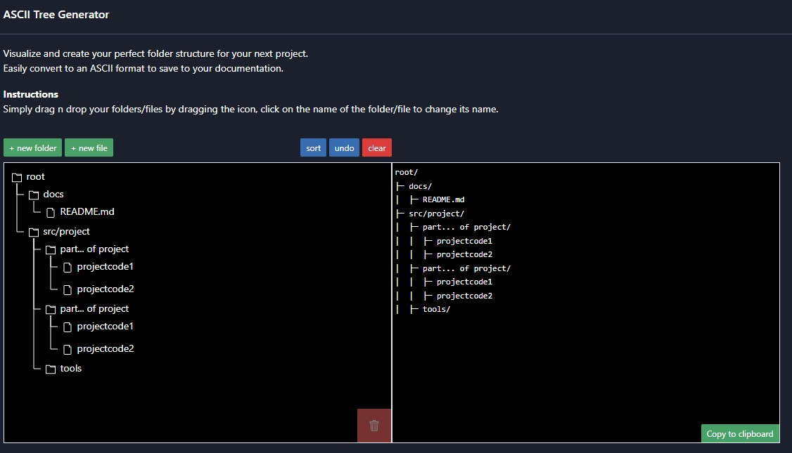

# Komplett Markdown Referanse

Dette dokumentet viser alle vanlige Markdown-elementer og syntaks.

## Sette opp innholdsfortegnelse med linking til elementer.
- [Overskrifter](#overskrifter)
- [Tekstformatering](#tekstformatering)
- [Lister](#lister)
    - [Unummererte lister](#unummererte-lister)
    - [Nummererte lister](#nummererte-lister)
    - [Oppgavelister](#oppgavelister)
- [Lenker](#lenker)
- [Bilder](#bilder)
- [Sitater](#sitater)
- [Kode](#kode)
    - [Inline kode](#inline-kode)
    - [Kodeblokker](#kodeblokker)
    - [Innrykket kodeblokk](#innrykket-kodeblokk)
- [Horisontale linjer](#horisontale-linjer)
- [Tabeller](#tabeller)
    - [Tabell med justering](#tabell-med-justering)
- [Fotnoter](#fotnoter)
- [Definisjons-lister](#definisjons-lister)
- [HTML i Markdown](#html-i-markdown)
- [Escape-tegn](#escape-tegn)
- [Emojis (GitHub Flavored Markdown)](#emojis)
- [Ankerlenker](#ankerlenker)
    - [Min Seksjon](#min-anker)
- [Kombinerte elementer](#kombinerte-elementer)
    - [Liste med kode](#liste-med-kode)
    - [Liste med sitater](#liste-med-sitater)
    - [Tabell med lenker og formatering](#tabell-lenker)
- [Avanserte tips](#avanserte-tips)
    - [Linjeskift](#linjeskift)
    - [Unnvikende tekst](#unnvikende-tekst)
- [Vise Mappestruktur](#vise-mappestruktur)


---

## Overskrifter

# Overskrift nivå 1
## Overskrift nivå 2
### Overskrift nivå 3
#### Overskrift nivå 4
##### Overskrift nivå 5
###### Overskrift nivå 6

[⬆️](#komplett-markdown-referanse)

---

## Tekstformatering

**Fet tekst** eller __fet tekst__

*Kursiv tekst* eller _kursiv tekst_

***Fet og kursiv*** eller ___fet og kursiv___

~~Gjennomstreket tekst~~

[⬆️](#komplett-markdown-referanse)

---

## Lister

### Unummererte lister

- Element 1
- Element 2
  - Underelement 2.1
  - Underelement 2.2
    - Underelement 2.2.1
- Element 3

* Alternativ syntaks med stjerne
* Fungerer også
  * Med underelements

+ Pluss-tegn fungerer også
+ Som list-markør

### Nummererte lister

1. Første element
2. Andre element
3. Tredje element
   1. Underelement 3.1
   2. Underelement 3.2
4. Fjerde element

### Oppgavelister

- [x] Fullført oppgave
- [ ] Ufullført oppgave
- [ ] En annen oppgave

[⬆️](#komplett-markdown-referanse)

---

## Lenker

[Lenketekst](https://github.com/MarcusBrustad/Databasefaget-for-nettstudentene/tree/main)

[Lenke med tittel](https://github.com/MarcusBrustad/Databasefaget-for-nettstudentene/tree/main "Hover-tekst")

<https://github.com/MarcusBrustad/Databasefaget-for-nettstudentene/tree/main>

[Referanselenke][1]

[1]: https://github.com/MarcusBrustad/Databasefaget-for-nettstudentene/tree/main "Referanse"

[Lenke til fil](./..)

[⬆️](#komplett-markdown-referanse)

---

## Bilder


[](https://www.example.com)

[⬆️](#komplett-markdown-referanse)

---

## Sitater

> Dette er et sitat.
> Det kan strekke seg over flere linjer.

> Sitater kan også være nestet:
>> Dette er et nestet sitat

[⬆️](#komplett-markdown-referanse)

---

## Kode

### Inline kode

Dette er `inline kode` i en setning.

### Kodeblokker

```
Kodeblokk uten språk-spesifikasjon
function example() {
  return true;
}
```

```javascript
// JavaScript kodeblokk
function hello() {
  console.log("Hello, World!");
}
```

```python
# Python kodeblokk
def hello():
    print("Hello, World!")
```

```html
<!-- HTML kodeblokk -->
<div class="container">
  <h1>Tittel</h1>
</div>
```

### Innrykket kodeblokk

    Dette er også en kodeblokk
    Laget med 4 mellomrom innrykk

## Horisontale linjer

---

***

___

[⬆️](#komplett-markdown-referanse)

---

## Tabeller

| Kolonne 1 | Kolonne 2 | Kolonne 3 |
|-----------|-----------|-----------|
| Rad 1     | Data      | Mer data  |
| Rad 2     | Data      | Mer data  |

### Tabell med justering

| Venstrejustert | Sentrert | Høyrejustert |
|:---------------|:--------:|-------------:|
| Venstre        | Midten   | Høyre        |
| Tekst          | Tekst    | Tekst        |

[⬆️](#komplett-markdown-referanse)

---

## Fotnoter

Her er en setning med en fotnote.[^1]

Her er en annen med lengre fotnote.[^langnote]

[^1]: Dette er fotnoteteksten.

[^langnote]: Dette er en fotnote med flere avsnitt.

    Innrykk for å inkludere i samme fotnote.


[⬆️](#komplett-markdown-referanse)

---

## Definisjons-lister

Begrep 1
: Definisjon av begrep 1

Begrep 2
: Definisjon av begrep 2
: Alternativ definisjon av begrep 2

[⬆️](#komplett-markdown-referanse)

---

## HTML i Markdown

<div style="background-color: #f0f0f0; padding: 10px;">
  Dette er HTML inni Markdown
</div>

<details>
<summary>Klikk for å utvide</summary>

Dette innholdet er skjult til du klikker på sammendraget.

</details>

[⬆️](#komplett-markdown-referanse)

---

## Escape-tegn

Du kan bruke backslash for å escape spesielle tegn:

\* Stjerne uten å lage liste
\# Hashtag uten overskrift
\[Ikke en lenke\](text)

[⬆️](#komplett-markdown-referanse)

---

## Emojis (GitHub Flavored Markdown) {#emojis}

:smile: :heart: :rocket: :thumbsup:

[⬆️](#komplett-markdown-referanse)

---

## Ankerlenker

### Min Seksjon {#min-anker}

Du kan lenke til [Min Seksjon](#min-anker)

[⬆️](#komplett-markdown-referanse)

---

## Kombinerte elementer

### Liste med kode

1. Første steg
   ```bash
   npm install
   ```
2. Andre steg
   ```bash
   npm start
   ```

### Liste med sitater

- Punkt ett
  > Dette er et sitat under første punkt
- Punkt to
  > Et annet sitat

### Tabell med lenker og formatering {#tabell-lenker}

| Funksjon | Syntaks | Eksempel |
|----------|---------|----------|
| **Fet** | `**tekst**` | **eksempel** |
| *Kursiv* | `*tekst*` | *eksempel* |
| [Lenke](https://shorturl.at/dN96s) | `[tekst](url)` | [Klikk her](https://github.com/MarcusBrustad/Databasefaget-for-nettstudentene/tree/main) |

[⬆️](#komplett-markdown-referanse)

---

## Avanserte tips

### Linjeskift

For å lage linjeskift, avslutt linjen med to mellomrom  
eller bruk en tom linje mellom avsnitt.

### Unnvikende tekst

Du kan bruke `<br>` for linjeskift<br>eller ekstra mellomrom.


## Vise Mappestruktur

Du kan bruke en ren kodeblokk for å fint legge inn et ascii-tre for å vise din mappestruktur. 

**Eksempel på bruk**

```
root/
├─ docs/
│  ├─ README.md
├─ src/project/
│  ├─ part... of project/
│  │  ├─ projectcode1
│  │  ├─ projectcode2
│  ├─ part... of project/
│  │  ├─ projectcode1
│  │  ├─ projectcode2
│  ├─ tools/
```

[](https://ascii-tree-generator.com/ "ascii-tree-generator")
###### *Klikk på bildet for å komme til nettsiden*


**Nettside for link**

Et visuell og enkel mappe → ascii-tree verktøy  
[Tool](https://ascii-tree-generator.com/ "Ascii-tree-generator")

[⬆️](#komplett-markdown-referanse)

---

**Dette dokumentet dekker de fleste Markdown-elementer du vil trenge!**
